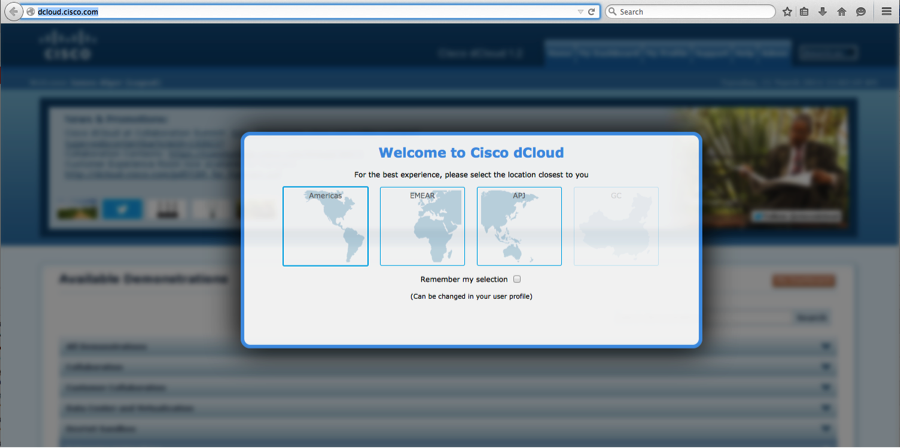

# Running your OpenDaylight APPs towards a Topology

The BGP and PCEP (Pathman) apps assume that you can connect to an OpenDaylight (ODL) Controller.

You will need the following information:

1. IP address and Port of controller
2. Authorization in the form of username and password

You topology would also need to be configured to interact with the ODL controller; BGP peering with BGP-LS speaker (i.e. one of the routers configured with BGP-LS) and PCEP peering enabled in all routers.

To simplify this step, we have implement a demonstration ODL controller and network topology available at dcloud .cisco.com. Below you will find the information required to have these apps interact with dCLoud.

# Accessing OpenDaylight Lithium SR1 at dCloud

First, you need to connect to dcloud.cisco.com and signup. If you are a new user, you may need to first signup at cco.cisco.com, and then at dcloud.

When connecting to dcloud, you will first be prompted to select a datacenter near you (shown in 1). After that you will be prompted to set up a profile.

- If you have any trouble in getting your profile setup, please consult the Help tab.

Figure 1 dCloud data center selection screen

Once connected to dCloud, you will see the content overview. From there, select Service Provider, and locate the [OpenDayLight Lithium SR1 Sandbox v1.](https://dcloud-cms.cisco.com/demo/opendaylight-lithium-sr1-sandbox-v1)

- --Then select Start/Schedule and pick a time for when you want to have access to the topology, or now.
- --Select the Session End time.
- --Click Next and answer the "use" questions.

Now you are done and you should have a session being started for you.

# How do I configure my APPs to talk to my dCloud ODL + topology?

Note:

These apps have been adapted to the Lithium release of Opendaylight.

**No changes are needed to run these apps towards the above-mentioned topology in dCloud.**

For other setups, you may need to change ip/port/auth details.

In your distribution, you will find two top-directories; pathman and next.

In pathman/pathman\_ini.py you will find:

odl\_ip = '198.18.1.80'

odl\_port = '8181'

odl\_user = 'admin'

odl\_password = 'admin'

Edit these values to match your private topo.

# How do I connect my laptop to the dCloud topology?

Depending on where you have installed the apps, you may want to consider different options to access your active dCloud session.

1. Cisco Anyconnect Client - [http://www.cisco.com/c/en/us/products/security/anyconnect-secure-mobility-client/index.html](http://www.cisco.com/c/en/us/products/security/anyconnect-secure-mobility-client/index.html)

2. Openconnect – see https://wiki.archlinux.org/index.php/OpenConnect

Regardless of client, you will need to check the access details for your session.

At dcloud.cisco.com, and the datacenter you have selected – click _My Dashboard_ and you will find your active session(s) listed there.

Select you session's '_View'_ button and then '_Review Session Info_', which takes you to _Session Details_. In Session Details, you will find your anyconnect credentials.

And if you 'click here for available options', you will see a view like this:

Figure 2 Anyconnect session credentials screen

Once connected, your laptop will be in the same network as the routers in your topology and the Lithium ODL controller.

Routers are at: 198.18.1.30 – 37. Username/password is cisco/cisco

Your ODL controller is at 198.18.1.80, ssh to port 8022 user/pass: cisco/cisco

Karaf is at 198.18.1.80, ssh to port 8101, user/password: karaf/karaf

RESTCONF API access to ODL is at 198.18.1.80, port 8181, user/password: admin/admin

# How to Configure and Launch BGP-LS Manager and Pathman Apps

1. Software prerequisites (above and beyond what is required for dCloud access):

> Chrome Version 45.0.2454.101 (64-bit) or higher
> Python 2.7 or 2.6
> Tornado 4.2.1
> requests 2.6.0

2. Access and configuration of the dCloud Lithium ODL sandbox (per the above).

3. Download BGP-LS Manager and Pathman apps from github located at xxx

4. You will see both NeXt and Pathman sub-directories under your root directory.

5. Under the pathman sub-directory, modify the pathman\_ini.py file to point to the remote ODL instance. No change is required if ODL is configured in dCloud.

6. Open a terminal window and change directory to Pathman.

7. Type in the following command: python rest\_server\_v5.py. This launches the "backend" of the BGP-LS and Pathman apps.

8. Open your Chrome Browser

9. URL to launch BGP-LS Manager: [http://localhost:8020/pathman/client/BGP/index.html](http://localhost:8020/pathman/client/BGP/index.html)

10. URL to launch Pathman: [http://localhost:8020/pathman/client/pathman/index.html](http://localhost:8020/pathman/client/pathman/index.html)